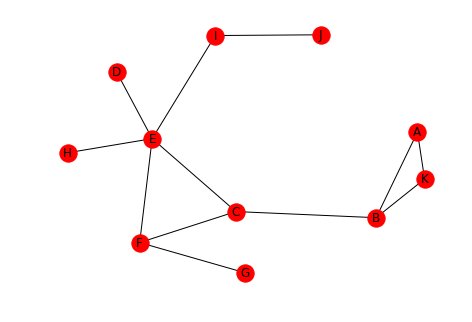
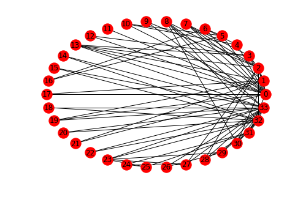

.. title: Distance in Social Networks
.. slug: distance-in-social-networks
.. date: 2017-09-24 12:49
.. tags: networks
.. link: 
.. description: Measuring Distance in Social Networks
.. type: text
.. author: hades

1 Introduction
--------------

When characterizing a graph one of the things to look at is how far apart the nodes are.

.. code:: ipython

    # from pypi
    import networkx

This will be the example network.

.. code:: ipython

    left = tuple("AAKBCCFEDEIE")
    right = tuple("KBBCFEGFEIJH")
    graph = networkx.Graph()
    graph.add_edges_from(list(zip(left, right)))
    networkx.draw(graph, with_labels=True)

2 Defining Distance
-------------------

This section will look at how we can measure the distance between nodes.

2.1 Paths
~~~~~~~~~

A path is a sequence of nodes connected by edges. One path from D to K might be D-E-C-B-K.

.. code:: ipython

    left = tuple('DECB')
    right = tuple("ECBK")
    path = networkx.Graph()
    path.add_edges_from(list(zip(left, right)))
    networkx.draw(path, with_labels=True)

.. image:: example_path.png

2.2 Distance
~~~~~~~~~~~~

- The *length* of a *path* is the number of edges in it.

- The *distance* between two nodes is the length of the *shortest* path between them.

.. code:: ipython

    dk_shortest_path = networkx.shortest_path(graph, "D", "K")
    print(dk_shortest_path)

::

    ['D', 'E', 'C', 'B', 'K']

.. code:: ipython

    length = networkx.shortest_path_length(graph, "D", "K")
    print(length)
    assert len(dk_shortest_path) - 1 == networkx.shortest_path_length(graph, "D", "K")

::

    4

As you can see the path we saw earlier is the shortest path and the distance from D to K is 4.

2.3 Breadth-First Search
~~~~~~~~~~~~~~~~~~~~~~~~

One way to compute the distances from one node to all the other nodes is to create a tree using Breadth-First-search. Breadth-First search will eliminate any cycles and leave us with the shortest paths to each node.

This is the tree created for the node A.

.. code:: ipython

    tree = networkx.bfs_tree(graph, "A")
    positions = networkx.drawing.nx_agraph.graphviz_layout(tree, prog="dot")
    networkx.draw(tree, positions, with_labels=True)

.. image:: example_bfs.png

.. code:: ipython

    print(networkx.shortest_path_length(graph, "A"))

::

    {'J': 5, 'D': 4, 'H': 4, 'F': 3, 'K': 1, 'A': 0, 'B': 1, 'C': 2, 'E': 3, 'G': 4, 'I': 4}

Looking at the shortest path-lengths to *A*, you can see that *J* is is the furthest away, with 5 edges separating them, while *B* and *K* are the closest with only 1 hop.

3 Graph Distance
----------------

This looks at how you can answer questions about the graph as a whole.

3.1 Average Distance
~~~~~~~~~~~~~~~~~~~~

One measure is the average of the distances between ever pair of nodes.

.. code:: ipython

    print(networkx.average_shortest_path_length(graph))

::

    2.5272727272727273

The average distance for our example is around two and a half edges.

3.2 Diameter
~~~~~~~~~~~~

The *diameter* of a graph is the maximum distance between any of the pairs of nodes. Note that *distance* is always the shortest path between nodes, so this isn't the longest path in the graph.

.. code:: ipython

    print(networkx.diameter(graph))

::

    5

The greatest distance is 5 hops in our example.

3.3 Eccentricity
~~~~~~~~~~~~~~~~

This is the largest distance between a node and all the other nodes.

.. code:: ipython

    print(networkx.eccentricity(graph))

::

    {'J': 5, 'D': 4, 'H': 4, 'F': 3, 'K': 5, 'A': 5, 'B': 4, 'C': 3, 'E': 3, 'G': 4, 'I': 4}

Looking at the output we can see that A, J, and K all have eccentricities matching the diameter. According to `the Online Etymology Dictionary <http://www.etymonline.com/index.php?term=eccentric&allowed_in_frame=0>`_, *eccentric* means an orbiting object that doesn't have the earth at the center of its orbit. More literally, it means out of center (or off center).

3.4 Radius
~~~~~~~~~~

The radius is the minimum eccentricity in a graph.

.. code:: ipython

    print(networkx.radius(graph))

::

    3

So the *radius* is the smallest of the largest distances for all the nodes.

3.5 Periphery
~~~~~~~~~~~~~

This is the set of nodes whose *eccentricity* is equal to the *diameter* (5 in our case).

.. code:: ipython

    print(networkx.periphery(graph))

::

    ['J', 'K', 'A']

Looking at the output and the graph, the diameter of the graph is the distance from A to J or K to J.

3.6 Center
~~~~~~~~~~

This is the set of nodes whose *eccentricity* is equal to the *radius* of the graph (3 in this example).

.. code:: ipython

    print(networkx.center(graph))

::

    ['F', 'C', 'E']

.. code:: ipython

    positions = networkx.drawing.nx_agraph.graphviz_layout(graph, prog="dot")
    networkx.draw(graph, positions, with_labels=True)

.. image:: center.png

Looking at the graph, you can see that F, C, and, E do in fact form the center triangle.

4 Karate Club
-------------

This looks at the network created by the relationships between members of a karate club that is on the verge of splitting up. Each node is a member of the club and the edges represent that the incident edges interacted with each other outside of the club (and were thus assumed to be friends). Members who didn't interact with each other outside of the club aren't represented in the data set.

The instructor wanted to raise fees while the officers didn't. Eventually the instructor was fired and his supporters left with him.

.. code:: ipython

    karate = networkx.karate_club_graph()
    networkx.draw(karate, with_labels=True)

.. image:: karate.png

.. code:: ipython

    networkx.draw_circular(karate, with_labels=True)

You can see that there are some central characters in the club, notably 0, 32, and 33.

.. code:: ipython

    degrees = ((node, karate.degree(node)) for node in karate.nodes())
    degrees = ((node, degree) for node, degree in degrees if degree > 10)
    print("Node\tDegree")
    for node, degree in degrees:
        print("{}\t{}".format(node, degree))

+----+------+
|Node|Degree|
+====+======+
|  0 |  16  |
+----+------+
|  32|  12  |
+----+------+
|  33|  17  |
+----+------+

The cut-off of 10 degrees was somewhat arbitrary, there are two nodes with degrees 9 and 10 respectively, but you can see that these three nodes were the most connected members of the club.

4.1 What is the average distance?
~~~~~~~~~~~~~~~~~~~~~~~~~~~~~~~~~

.. code:: ipython

    print(networkx.average_shortest_path_length(karate))

::

    2.4

The path lengths are relatively short, on average.

4.2 Diameter
~~~~~~~~~~~~

.. code:: ipython

    print(networkx.diameter(karate))

::

    5

The maximum distance is 5.

4.3 Eccentricity
~~~~~~~~~~~~~~~~

.. code:: ipython

    print(networkx.eccentricity(karate))

::

    {0: 3, 1: 3, 2: 3, 3: 3, 4: 4, 5: 4, 6: 4, 7: 4, 8: 3, 9: 4, 10: 4, 11: 4, 12: 4, 13: 3, 14: 5, 15: 5, 16: 5, 17: 4, 18: 5, 19: 3, 20: 5, 21: 4, 22: 5, 23: 5, 24: 4, 25: 4, 26: 5, 27: 4, 28: 4, 29: 5, 30: 4, 31: 3, 32: 4, 33: 4}

4.4 Radius
~~~~~~~~~~

What is the smallest eccentricity?

.. code:: ipython

    print(networkx.radius(karate))

::

    3

4.5 Periphery
~~~~~~~~~~~~~

Which nodes are furthest apart?

.. code:: ipython

    print(networkx.periphery(karate))

::

    [14, 15, 16, 18, 20, 22, 23, 26, 29]

4.6 Center
~~~~~~~~~~

.. code:: ipython

    print(networkx.center(karate))

::

    [0, 1, 2, 3, 8, 13, 19, 31]

The center nodes are most likely the ones that kept information flowing between the two factions (although node 0 is in here as well).
