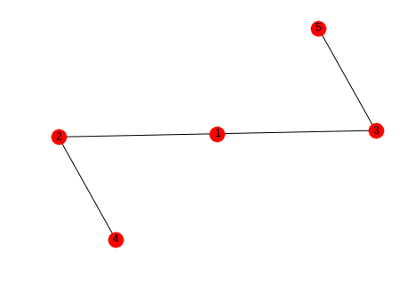
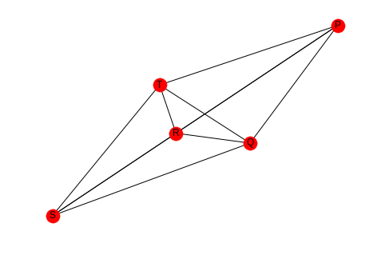

.. title: Triadic Closure (Clustering)
.. slug: triadic-closure
.. date: 2017-09-23 16:48 
.. tags: networks
.. link: 
.. description: Measuring network clustering
.. type: text
.. author: hades

Introduction
------------

**Triadic Closure** is a measure of the tendency of edges in a graph to form triangles. It's a measure of the degree to which nodes in a graph tend to cluster together (`wikipedia on clustering coefficents <https://en.wikipedia.org/wiki/Clustering_coefficient>`_).

.. code:: ipython

    # python standard library
    from fractions import Fraction

    # pypi
    import networkx
    import seaborn

.. code:: ipython

    % matplotlib inline
    seaborn.set_style("whitegrid")

.. code:: ipython

    sample_graph = networkx.Graph()
    sample_graph.add_edges_from([(1, 2), (1, 3), (2, 4), (3, 5)])
    networkx.draw_spring(sample_graph, with_labels=True)

In this case we might say that the likelihood that the next edge will be between 1 and 4 or 1 and 5 is greater than the likelihood that it will form between 4 and 5 or 2 and 5.

2 Local Clustering Coefficient
------------------------------

The **Local Clustering Coefficient** is a measure of clustering for a single node. It is the number of pairs of a node's friends that are themselves friends divided by the total number of pairs of a node's friends. This can be interpreted as measuring how close the node's neighbors are to being a complete graph (`wikipedia <https://en.wikipedia.org/wiki/Clustering_coefficient#Local_clustering_coefficient>`_).

.. math::

   LCC = \frac{\textit{number of pairs of a node's friends that are friends (PTAF)}}{\textit{number of pairs of the node's friends (POF)}}
   
.. code:: ipython

    graph = networkx.Graph()
    graph.add_edges_from([("A", "K"), ("A", "B"), ("A", "C"),
                          ("B", "K"), ("B", "C"),
                          ("C", "E"), ("C", "F"),
                          ("D", "E"),
                          ("E", "F"), ("E", "H"),
                          ("F", "G"),
                          ("I", "J")])

                          .. ggcode:: ipython

    networkx.draw_spring(graph, with_labels=True)

.. image:: triadic_example.png

The number of pairs of friends can be calculated from the degree of the node.

.. math::

   POF = \frac{d(d-1)}{2}

Looking at node C, it has degree four so the number of pairs of friends it has is :math:`\frac{4(3)}{2} = 6`. Looking at the graph you can see that there are two edges between the nodes connected to it - (A,B) and (E, F), so the clustering coefficient for node C is :math:`\frac{PTAF}{POF}=\frac{2}{6}` which reduces to 1/3. We can double check this with networkx.

.. code:: ipython

    print(networkx.clustering(graph, "C"))

::

    0.3333333333333333

If you don't pass in the node label to ``networkx.clustering`` the function will return a dictionary with all the clustering coefficients, which might be useful if you need to make multiple queries and have a large graph.

2.1 One Friend
~~~~~~~~~~~~~~

If you look at nodes I and J, they don't have any pairs of friends, just one friend each. This puts a zero in the denominator of the clustering coefficient, making it undefined, but to make it mathematically useful it is given a 0 instead.

.. code:: ipython

    print(networkx.clustering(graph, "I"))

::

    0.0

3 The Whole Network
-------------------

There's two ways to calculate a clustering coefficient for the entire network. One is to take the average of all the local clustering coefficients, the other is to calculate the percentage of open triads (three nodes connected by two edges) that are triangles.

3.1 Averaging
~~~~~~~~~~~~~

This is what wikipedia calls the `network average clustering coefficient <https://en.wikipedia.org/wiki/Clustering_coefficient#Network_average_clustering_coefficient>`_.

.. code:: ipython

    coefficients = networkx.clustering(graph)
    average = sum(coefficients.values())/len(coefficients)
    print(average)
    assert average == networkx.average_clustering(graph)

::

    0.28787878787878785

3.2 Transitivity
~~~~~~~~~~~~~~~~

This is also called the `global clustering coefficient <https://en.wikipedia.org/wiki/Clustering_coefficient#Global_clustering_coefficient>`_.

A *triangle* is a set of three nodes with three edges connecting them.  An *open triad* is a set of three nodes with only two edges connecting them. Each triangle has three open triads embedded in it. *Transivity* is a measure of the percentage of open triads that are triangles.

This triangle:

.. code:: ipython

    triangle = networkx.Graph()
    triangle.add_edges_from([("A", "B"), ("A", "C"), ("B", "C")])

    networkx.draw_spring(triangle, with_labels=True)

.. image:: tc_one.png

Contains these open triads.

.. code:: ipython

    one = networkx.Graph()
    one.add_edges_from([("A", "B"), ("A", "C")])
    networkx.draw(one, with_labels=True)

.. image:: tc_a.png

.. code:: ipython

    two = networkx.Graph()
    two.add_edges_from([("A", "B"), ("B", "C")])
    networkx.draw(two, with_labels=True)

.. image:: tc_b.png

.. code:: ipython

    three = networkx.Graph()
    three.add_edges_from([("B", "C"), ("A", "C")])
    three.add_edges_from([("B", "C"), ("A", "C")])
    networkx.draw(three, with_labels=True)

.. image:: tc_c.png

So the transitivity is three times the count of triangles in the graph divided by all the open triads in the graph.

.. math::

   transitivity = \frac{3 \times \|\textit{triangles}\|}{\|\textit{open triads}\|}

Looking at our earlier example you can see that there are three triangles and thirteen open triads (to be honest I only found 10).

.. code:: ipython

    networkx.draw_spring(graph, with_labels=True)

.. image:: triadic_example.png

.. code:: ipython

    transitivity = (3 * 3)/(3 * 3 + 13)
    print(transitivity)
    assert transitivity == networkx.transitivity(graph)

::

    0.4090909090909091

4 Comparing Averaging and Transitivity
--------------------------------------

4.1 One High Degree Node
~~~~~~~~~~~~~~~~~~~~~~~~

.. code:: ipython

    high_lcc = networkx.Graph()
    left = tuple("AABCCDEEFGGH")
    right = tuple("BIIDIIFIIHII")
    high_lcc.add_edges_from(list(zip(left, right)))
    networkx.draw_spring(high_lcc, with_labels=True)

.. image:: high_average.png

If we look at this graph, the outer nodes all have a clustering coefficient of 1 (each has 1 pair of friends that are friends) while the center node has a coefficient of 1/7, since half the pairs don't have edges between them.

.. code:: ipython

    degree_i = 8
    pairs_of_friends = Fraction(8 * 7, 2)
    pairs_that_are_friends = Fraction(4, 1)
    lcc = pairs_that_are_friends/pairs_of_friends
    print(lcc)

::

    1/7

Since there are so many nodes with a coefficient of 1, the average is high.

.. code:: ipython

    print(networkx.average_clustering(high_lcc))

::

    0.9047619047619047

But there are many open triads so the transitivity will be low (transitivity weights nodes with large degree higher, but there's only one node with degree greater than 2).

.. code:: ipython

    print(networkx.transitivity(high_lcc))

::

    0.3333333333333333

4.2 Many Open Pairs
~~~~~~~~~~~~~~~~~~~

.. code:: ipython

    outer_left = "ABDEGHJKMN"
    inner_left = "PPPPQQQRRS"
    outer_right = "BCEFHIKLNO"
    inner_right = "QRSTRSTSTT"
    left = tuple(outer_left + inner_left)
    right = tuple(outer_right + inner_right)
    low_average = networkx.Graph()
    low_average.add_edges_from(list(zip(left, right)))
    networkx.draw(low_average, with_labels=True)

.. image:: low_average.png

Here the nodes P, Q, R, S, and T are completely connected (it's hard to see) but all the other nodes are open triads so the average will be low, but the transitivity will be high, because each of the P, Q, R, S, and T form triangles. This should be easier to see if they are plotted separately.

.. code:: ipython

    left = tuple(inner_left)
    right = tuple(inner_right)
    inner = networkx.Graph()
    inner.add_edges_from(list(zip(left, right)))
    networkx.draw(inner, with_labels=True)

Here's the average clustering coefficient (for the complete graph, not the sub-graph I just made).

.. code:: ipython

    print(networkx.average_clustering(low_average))

::

    0.25

And here's the transitivity.

.. code:: ipython

    print(networkx.transitivity(low_average))

::

    0.8571428571428571

So which one is the right metric? I guess it just depends.
